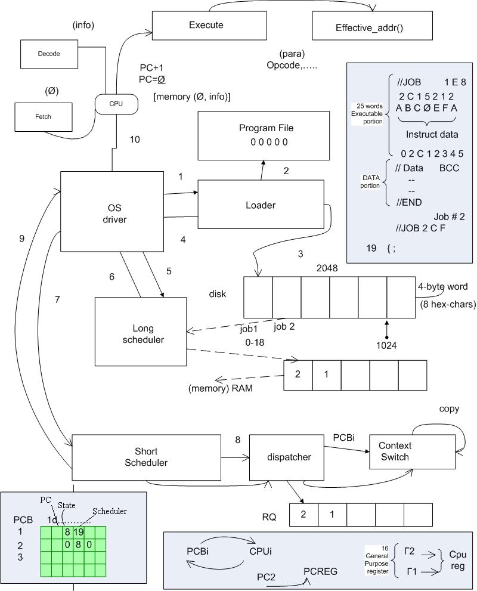

# OS-Group-Project
## Colaborators
- :tennis: Eric Schneider
- :notes: Zachery Auzenne
- :frog: Eshin Griffith
- :wolf: Alex Denton
- :dog: Charlie McDermitt
## Todo
1. :tennis: Implement Disk Read function
2. :tennis: Implement Disk Write function
3. :notes: Implement PCB
4. Implement Driver
5. :dog: Implement Loader Read
6. :dog: Implement Loader Write
7. :frog: Implement CPU
8. :wolf: Implement Decoder

## Goal

